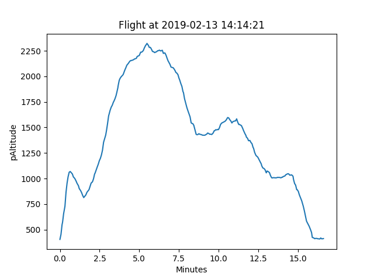
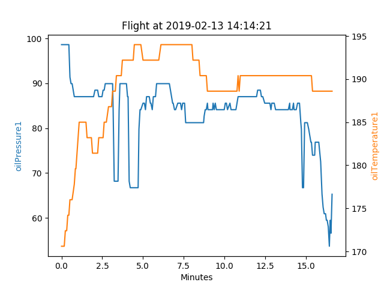

# MGL EFIS Data Display

Reads MGL Avionics `IEFISBB.DAT` files and graphs the data. 

Create a Plot() object and use it to generate gaphs. See `main.py` for an example of creating a Plot() object. Edit the values of `datafile`, `minTimestamp`, and `maxTimestamp` as required.

## List All Flights in IEFISSBB.DAT
```
>>> printFlights(flights)Flights:
 0: Flight from 2018-06-13 19:01:44 to 2018-06-13 19:06:13,   926 messages, 429,600,874 - 429,601,163
 1: Flight from 2019-02-03 10:11:30 to 2019-02-03 10:20:23,   514 messages, 478,585,564 - 478,586,132
 2: Flight from 2019-02-03 10:55:25 to 2019-02-03 10:55:58,   153 messages, 478,588,375 - 478,588,408
 3: Flight from 2019-02-03 11:09:38 to 2019-02-03 11:10:13,   128 messages, 478,589,541 - 478,589,579
 4: Flight from 2019-02-13 14:14:21 to 2019-02-13 14:29:57,  3903 messages, 479,912,852 - 479,913,848
```

## Display One Line
```python
>>> p = Plot(flights[4])           # create a Plot object from flight #4
>>> p.plot('pAltitutde')           # plot pressure altitude
>>> p.show()                       # display the graph
```



## Display Two Lines
```
>>> p = Plot(flights[4])                           # create a Plot object from flight #4
>>> p.plot2(['oilPressure1', 'oilTemperature1'])   # plot oil pressure and temperature
>>> p.show()                                       # display the graph
```



```
>>> p = Plot(flights[4])                   # create a Plot object from flight #4
>>> p.plot2(['headingMag', 'trueTrack'])   # plot heading and true (ground) track
>>> p.show()                               # display the graph
```


## Save Graph as File
```
>>> p = Plot(flights[4])           # create a Plot object from flight #4
>>> p.plot('pAltitutde')           # plot pressure altitude
>>> p.save('mygraph.pdf')          # save graph as a PDF file
```

```
>>> p = Plot(flights[4])           # create a Plot object from flight #4
>>> p.plot('asi')                  # plot airspeed
>>> p.save('mygraph.png')          # save graph as a PNG file
```

## List All Plottable Attributes
```
>>> p = Plot(flights[4])           # create a Plot object from flight #4
>>> p.listAttributes()             # display a list of attributes that can be plottedagl
ambientPressure
aoa
asi
...
yawAngle
year
```

## Author

Art Zemon <br>
art@zemon.name <br>
https://cheerfulcurmudgeon.com/